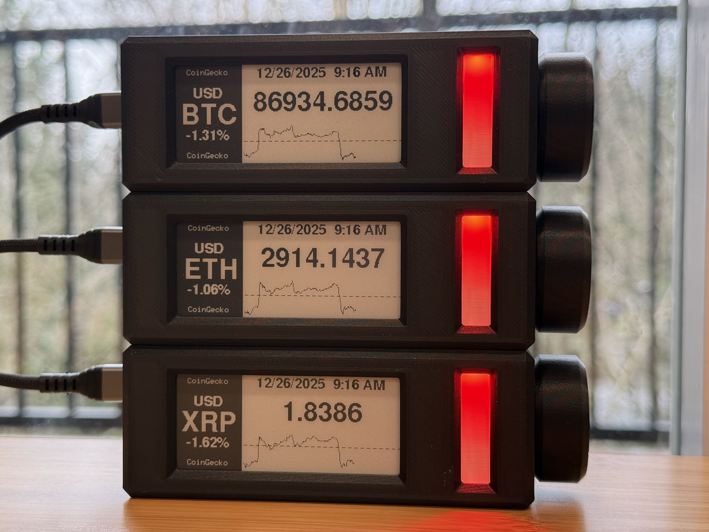

# CryptoBar

> Open-source ESP32-S3 cryptocurrency price display with e-ink screen and encoder control—an affordable, customizable alternative to overpriced commercial tickers.



*Three CryptoBar units stacked using magnets, displaying real-time cryptocurrency prices with LED status indicators*

---

## 📖 Overview

CryptoBar is an ESP32-S3-based cryptocurrency display that started as a personal challenge to build a better, cheaper alternative to expensive commercial solutions like Tickrmeter. Frustrated with overpriced devices packed with features most users never need, CryptoBar delivers what you actually want: real-time crypto prices, a clean e-ink display, and intuitive rotary encoder navigation—all without smartphone app dependency.

Now open-sourced for the maker community, CryptoBar offers complete hardware and software customization at a fraction of the cost of commercial alternatives.

### Why CryptoBar?

- ✅ **Affordable**: DIY build costs significantly less than commercial alternatives
- ✅ **No Phone Required**: Hardware encoder navigation, no app needed
- ✅ **Customizable**: Open-source hardware and software
- ✅ **Reliable**: Multi-layer API fallback system (4 data sources)
- ✅ **Low Power**: E-ink display for always-on operation
- ✅ **Professional**: Clean design with 3D printed enclosure

---

## ✨ Features

### Display & Interface
- 📊 **2.9" E-ink Display** - Low power, high contrast, readable in any lighting
- 🎛️ **Rotary Encoder Navigation** - Intuitive menu control with push-button
- 🎨 **RGB LED Status Indicator** - Price trends with party mode for +20% gains
- ⏰ **Timezone-Aware Clock** - Auto-detection with 27 timezone options (UTC-12 to UTC+14)

### Cryptocurrency Support
- 🪙 **20 Cryptocurrencies**: BTC, ETH, BNB, XRP, SOL, TRX, DOGE, ADA, BCH, LINK, XMR, XLM, LTC, AVAX, HBAR, SHIB, TON, UNI, DOT, KAS (sorted by market cap)
- 💱 **9 Display Currencies**: USD, TWD, EUR, GBP, CAD, JPY, KRW, SGD, AUD
- 📈 **24-Hour Price Charts** - Visual price history on e-ink display
- 📊 **24h Change Percentage** - Real-time gain/loss tracking

### Data Reliability
- 🔄 **Multi-Layer API Fallback**:
  1. CoinGecko (aggregated data from 500+ exchanges)
  2. CoinPaprika (aggregated data from 200+ exchanges)
  3. Kraken (direct exchange data)
  4. Binance (direct exchange data)
- ⏱️ **Configurable Update Intervals**: 1min, 3min (recommended), 5min, 10min
- 🌐 **Distributed API Load**: MAC-based jitter prevents rate limit issues
- 🎯 **High Precision**: Full 14-16 decimal place accuracy from CoinGecko

### Smart Features
- 🔄 **Independent Time Refresh**: Clock updates every minute regardless of price interval
- 📊 **Day Average Modes**: Off, Rolling 24h, ET 7pm cycle
- 🎚️ **LED Brightness Control**: Low / Medium / High
- 🔃 **Display Refresh Modes**: Partial (battery-friendly) / Full (ghosting-free)
- 📡 **OTA Firmware Updates**: Update wirelessly via web interface
- 🌐 **WiFi Configuration Portal**: Easy setup through captive portal


*Professional 3D-printed enclosure with rotary encoder knob and LED light diffuser*

---

## 🛠️ Hardware Requirements

### Core Components

| Component | Specifications | Quantity | Amazon Link |
|-----------|---------------|----------|-------------|
| **ESP32-S3 Development Board** | N16R8 (16MB Flash, 8MB PSRAM) | 1 | [Buy on Amazon](https://amzn.to/4952HZK) |
| **E-ink Display** | WaveShare 2.9" B&W e-Paper Module | 1 | [Buy on Amazon](https://amzn.to/4pdoJj1) |
| **Rotary Encoder** | KY-040 Module with Ribbon Cable | 1 | [Buy on Amazon](https://amzn.to/3Lip1Hm) |
| **RGB LED** | WS2812B LED Strip (need 1 LED) | 1 | [Buy on Amazon](https://amzn.to/3YPYPXD) |

### Hardware & Fasteners

| Component | Quantity | Amazon Link |
|-----------|----------|-------------|
| M3 x 8mm Hex Screws | 2 | [Buy Kit](https://amzn.to/3L2rsOg) |
| M2 x 5mm Flat Head Screws | 4 | [Buy Kit](https://amzn.to/44HXbLf) |
| M3 Heat Set Inserts | 2 | [Buy](https://amzn.to/44HXbLf) |
| M2 Heat Set Inserts | 4 | [Buy](https://amzn.to/49rPdbL) |

**Note:** Many components come in multi-packs. Consider building multiple units to maximize value.

### 3D Printing Materials

| Component | Recommended Product | Amazon Link |
|-----------|---------------------|-------------|
| **Black PLA Filament** | PolyMaker Matte Black PLA (enclosure parts) | [Buy on Amazon](https://amzn.to/4atrUPS) |
| **White PLA Filament** | PolyMaker Matte White PLA (LED lens - REQUIRED) | [Buy on Amazon](https://amzn.to/4qquieL) |

- **Files:** Available in [`hardware/3d-printed-case/`](hardware/3d-printed-case/)
- **Enclosure:** Matte Black PLA recommended (or any color)
- **LED Lens:** **Matte White PLA REQUIRED** for optimal light diffusion
- **Print Time:** ~3-4 hours total
- **Cost:** ~$2 USD material cost (if you have a 3D printer)
- **Post-Processing:** Heat set insert installation required (soldering iron)

### Power Supply

| Component | Description | Amazon Link |
|-----------|-------------|-------------|
| **USB-C Cable & Adapter** | USB-C cable + power adapter kit | [Buy on Amazon](https://amzn.to/3KO9BKZ) |

- **Input:** 5V via USB-C, 1A minimum
- **Power Consumption:** ~0.5W average (e-ink refresh), <0.1W standby

---

## 🚀 Quick Start

### Build Instructions

1. **Order Components** - Use Amazon links above or source locally
2. **3D Print Enclosure** - Files in `hardware/3d-printed-case/`
3. **Install PlatformIO** - [Download PlatformIO IDE](https://platformio.org/install/ide?install=vscode)
4. **Clone Repository**:
   ```bash
   git clone https://github.com/max05210238/CryptoBar.git
   cd CryptoBar
   ```
5. **Compile & Upload Firmware**:
   ```bash
   pio run -t upload
   ```
6. **Assemble Hardware** - Follow [Hardware Assembly Guide](docs/guides/HARDWARE_GUIDE.md)
7. **Configure WiFi** - Device creates "CryptoBar-XXXXXX" AP on first boot

**Estimated Build Time:** 2-4 hours (including 3D printing)
**Estimated Cost:** ~$35 USD (with own 3D printer, ~$40 if using print service)

---

## 📚 Documentation

### User Guides
- 📘 [**Hardware Assembly Guide**](docs/guides/HARDWARE_GUIDE.md) - Wiring, GPIO pins, assembly steps
- 📺 [**Display Guide**](docs/guides/DISPLAY_GUIDE.md) - UI layout, navigation, screen elements explained
- 🎨 [**LED Display Guide**](docs/guides/LED_DISPLAY_GUIDE.md) - LED colors, animations, troubleshooting
- 🔄 [**OTA Update Guide**](docs/guides/OTA_UPDATE_GUIDE.md) - Firmware updates and security considerations
- ⚙️ [**Configuration Guide**](docs/guides/CONFIGURATION_GUIDE.md) - WiFi setup, settings options (Coming Soon)
- 🚨 [**Troubleshooting Guide**](docs/guides/TROUBLESHOOTING.md) - Common issues and solutions (Coming Soon)

### Technical Documentation
- 📝 [**Changelog**](CHANGELOG.md) - Detailed version history (V0.97 → V0.99q)
- 📄 [**Release Notes**](docs/release-notes/) - Technical details for each version
- 🔧 [**Pre-Launch Audit**](PRE_LAUNCH_AUDIT.md) - Documentation review and roadmap

---

## ⚙️ Configuration

### Supported Cryptocurrencies (20)
BTC, ETH, BNB, XRP, SOL, TRX, DOGE, ADA, BCH, LINK, XMR, XLM, LTC, AVAX, HBAR, SHIB, TON, UNI, DOT, KAS

**Sorted by market cap rank.** Stablecoins (USDT/USDC) intentionally excluded.

### Display Currencies (9)
USD, TWD, EUR, GBP, CAD, JPY, KRW, SGD, AUD

### Update Intervals

Choose your update frequency based on your needs and number of devices:

| Interval | Best For | CoinGecko API Usage | Notes |
|----------|----------|---------------------|-------|
| **1 minute** | Active traders, 1-4 devices | ~60 requests/hour per device | ⚡ Real-time tracking |
| **3 minutes** ⭐ | 5-8 devices, general use | ~20 requests/hour per device | **Recommended** - balances freshness and API limits |
| **5 minutes** | 9+ devices, battery-friendly | ~12 requests/hour per device | 🔋 Extended uptime |
| **10 minutes** | 9+ devices, maximum savings | ~6 requests/hour per device | 🔋🔋 Maximum battery life |

**⚠️ CoinGecko API Limit:** The free tier allows **30 requests/minute** across all your devices sharing the same network. If you exceed this limit, you may experience temporary API blocks.

**Multi-Device Calculation:**
- **1-4 devices @ 1min**: 4 devices × 1 req/min = 4 req/min ✅ Safe
- **8 devices @ 3min**: 8 devices ÷ 3 min = ~2.7 req/min ✅ Safe
- **10 devices @ 1min**: 10 devices × 1 req/min = 10 req/min ⚠️ Approaching limit
- **10 devices @ 5min**: 10 devices ÷ 5 min = 2 req/min ✅ Safe

**Note:** CryptoBar includes MAC-based jitter (0-10 second random delay) to distribute API requests and prevent rate limit issues even with multiple devices.

### Refresh Modes
- **Partial Refresh** - Fast updates, minimal ghosting, battery-friendly
- **Full Refresh** - Complete screen clear, eliminates ghosting, slower

### Timezone Support
27 timezones from UTC-12 (Baker Island) to UTC+14 (Kiritimati)
- Auto-detection on first boot
- Manual selection in settings menu

---

## 🎨 LED Status Indicator

Quick reference for LED colors:

| Color | Meaning | Condition |
|-------|---------|-----------|
| 🟢 **Green** | Price rising | 24h gain > +0.02% |
| 🔴 **Red** | Price falling | 24h loss < -0.02% |
| 🌈 **Rainbow** | Party Mode! | 24h gain ≥ +20% 🎉 |
| 🟡 **Yellow** | API failure | Can't fetch prices |
| 🔵 **Blue** | Connecting | WiFi connection in progress |
| 🟣 **Purple** | Configuration | WiFi portal or firmware update mode |

**Breathing Animation:**
- Static (< 5% change)
- Slow breathing (5-10% change)
- Fast breathing (≥ 10% change)

Full details: [LED Display Guide](docs/guides/LED_DISPLAY_GUIDE.md)

---

## 🔌 GPIO Pin Assignments

| Component | Pin Function | GPIO | Notes |
|-----------|--------------|------|-------|
| **E-ink Display** | CS (Chip Select) | GPIO 10 | SPI |
| | DC (Data/Command) | GPIO 17 | - |
| | RST (Reset) | GPIO 16 | - |
| | BUSY | GPIO 4 | Status input |
| **Rotary Encoder** | CLK (Phase A) | GPIO 2 | PCNT-compatible |
| | DT (Phase B) | GPIO 1 | PCNT-compatible |
| | SW (Button) | GPIO 21 | Active low |
| **Status LED** | NeoPixel Data | GPIO 15 | WS2812B |

**Note:** GPIO 2/1 specifically chosen for ESP32-S3 PCNT (Pulse Counter) peripheral support.

See [Hardware Guide](docs/guides/HARDWARE_GUIDE.md) for detailed wiring diagrams.

---

## 🌐 API Data Sources

CryptoBar uses a robust 4-layer fallback system for maximum reliability:

### Current Price Data
1. **CoinGecko** (Primary) - Aggregated from 500+ exchanges
2. **CoinPaprika** (Fallback 1) - Aggregated from 200+ exchanges
3. **Kraken** (Fallback 2) - Direct exchange data
4. **Binance** (Fallback 3) - Direct exchange data

### Historical Chart Data
1. **CoinGecko** (Primary) - Aggregated historical data
2. **Binance** (Fallback 1) - Kline/candlestick data
3. **Kraken** (Fallback 2) - OHLC data

### Exchange Rate Data
- **Primary:** open.er-api.com (1,500 requests/month)
- **Fallback:** fxratesapi.com (unlimited)

**Rate Limit Management:**
- MAC-based request jitter (0-10 seconds)
- Recommended 3-minute update interval for multi-device deployments
- Automatic retry on failure

**No API Keys Required** - All APIs used are free-tier public endpoints.

---

## 📊 Recent Improvements (V0.97 → V0.99q)

### V0.99q (2025-12-25) - Latest
- ✅ **WiFi Portal Settings Fix**: All advanced settings now properly applied
- ✅ **Independent Time Refresh**: Clock updates every minute (desk clock mode)
- ✅ **Timezone Menu Consistency**: UTC-sorted ordering in web portal

### Recent Highlights
- **V0.99p**: High-precision price display (14-16 decimals from CoinGecko)
- **V0.99o**: MAC-based API jitter for distributed load
- **V0.99n**: CoinGecko as primary API (better quality)
- **V0.99l**: Display refresh optimization (95% less flicker)
- **V0.99k**: Aggregated market data (200+ exchanges)
- **V0.99h**: LED party mode for +20% gains
- **V0.99g**: Binance API integration (38% faster, 75% fewer failures)
- **V0.99f**: Multi-currency support (9 currencies)
- **V0.99a**: Encoder optimization (critical GPIO fix for ESP32-S3)

See [CHANGELOG.md](CHANGELOG.md) for complete version history.

---

## 🛠️ Development

### Building Firmware

**Requirements:**
- [PlatformIO](https://platformio.org/)
- ESP32-S3 board connected via USB

**Compile:**
```bash
pio run
```

**Upload:**
```bash
pio run -t upload
```

**Monitor Serial Output:**
```bash
pio device monitor
```

### Project Structure

```
CryptoBar/
├── src/                    # Source code (modular architecture)
│   ├── main.cpp           # Main application logic
│   ├── app_state.cpp      # Global state management
│   ├── app_wifi.cpp       # WiFi management
│   ├── app_time.cpp       # NTP sync and timezone
│   ├── network.cpp        # API fetching (4-layer fallback)
│   ├── ui.cpp             # E-ink display rendering
│   ├── led_status.cpp     # RGB LED control
│   ├── encoder_pcnt.cpp   # Rotary encoder (PCNT)
│   └── ...
├── include/               # Header files
├── docs/                  # Documentation
│   ├── guides/           # User guides
│   └── release-notes/    # Version technical details
├── hardware/             # 3D models and schematics
│   └── 3d-printed-case/  # STL files
├── platformio.ini        # PlatformIO configuration
└── CHANGELOG.md          # Version history
```

### Code Architecture

- **Modular Design**: Functionality split into focused modules (V0.98 refactoring)
- **State Management**: Centralized global state in `app_state.cpp`
- **Multi-API Resilience**: Automatic failover across 4 data sources
- **Hardware Abstraction**: PCNT peripheral for encoder, GxEPD2 for display
- **OTA Support**: Dual partition table for safe wireless updates

---

## 🤝 Contributing

Contributions are welcome! This project is open-source to benefit the maker community.

### How to Contribute

1. Fork the repository
2. Create a feature branch (`git checkout -b feature/amazing-feature`)
3. Commit your changes (`git commit -m 'Add amazing feature'`)
4. Push to the branch (`git push origin feature/amazing-feature`)
5. Open a Pull Request

### Areas for Contribution

- 📱 Additional API integrations
- 🌐 More cryptocurrency support
- 🎨 Alternative display layouts
- 🔧 Hardware modifications (battery power, different displays)
- 📚 Documentation improvements
- 🌍 Translations

---

## 📄 License

This project is licensed under the **MIT License** - see [LICENSE](LICENSE) file for details.

**Copyright © 2025 max05210238**

You are free to:
- ✅ Use commercially
- ✅ Modify
- ✅ Distribute
- ✅ Private use

---

## 🙏 Credits

**Developer:** [max05210238](https://github.com/max05210238)
**AI Development Assistant:** Claude (Anthropic)

**Hardware:**
- ESP32-S3 (Espressif Systems)
- WaveShare 2.9" e-Paper Display
- Bourns PEC11R-S0024 Rotary Encoder (recommended)

**Software Libraries:**
- [GxEPD2](https://github.com/ZinggJM/GxEPD2) - E-ink display driver
- [ArduinoJson](https://arduinojson.org/) - JSON parsing
- [Adafruit GFX](https://github.com/adafruit/Adafruit-GFX-Library) - Graphics library
- [Adafruit NeoPixel](https://github.com/adafruit/Adafruit_NeoPixel) - LED control

---

## 💬 Support & Community

- 🐛 **Bug Reports:** [GitHub Issues](https://github.com/max05210238/CryptoBar/issues)
- 💡 **Feature Requests:** [GitHub Discussions](https://github.com/max05210238/CryptoBar/discussions)
- 📧 **Contact:** Via GitHub

---

## ⚠️ Disclaimer

This device displays cryptocurrency prices for informational purposes only. It is not financial advice. Always do your own research before making investment decisions.

---

**Made with ❤️ for the crypto and maker communities**

**Star ⭐ this project if you find it useful!**
