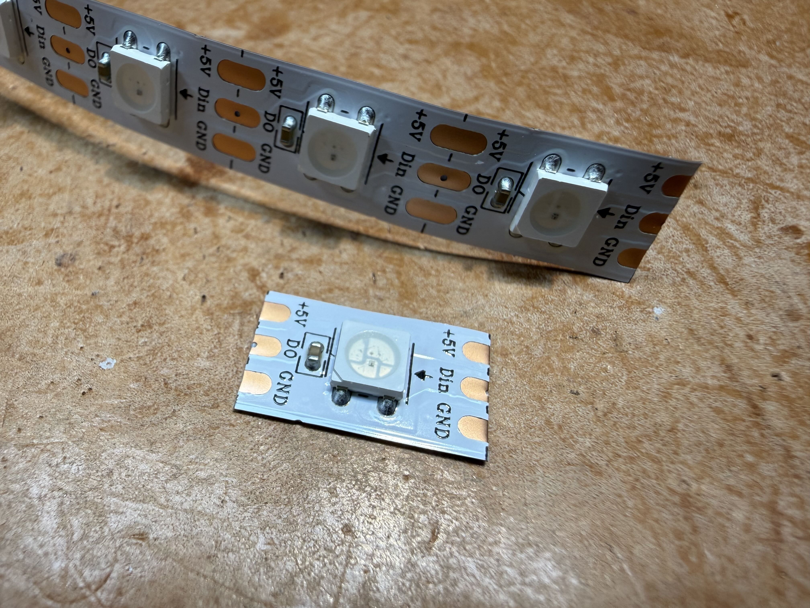
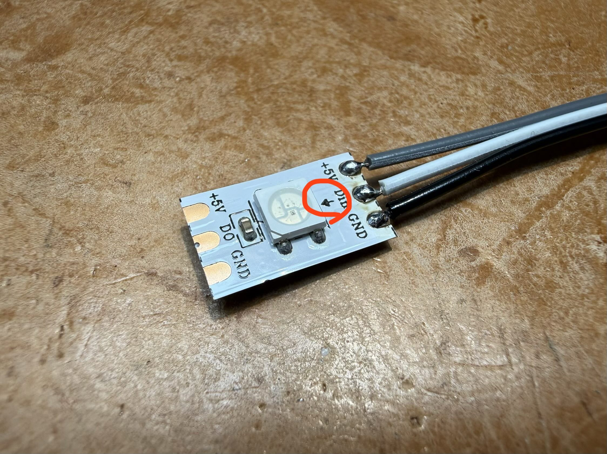
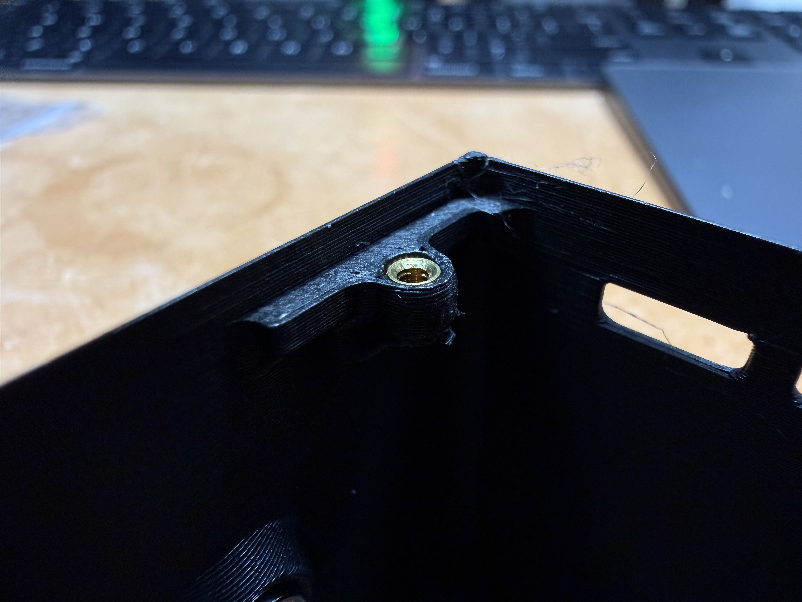
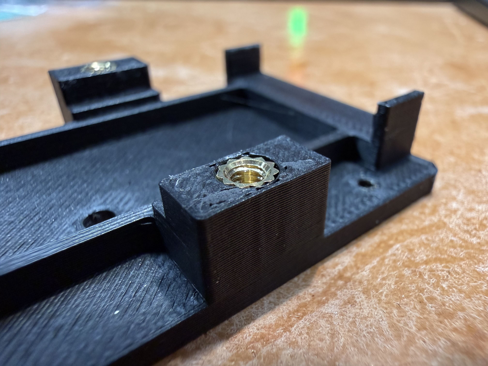
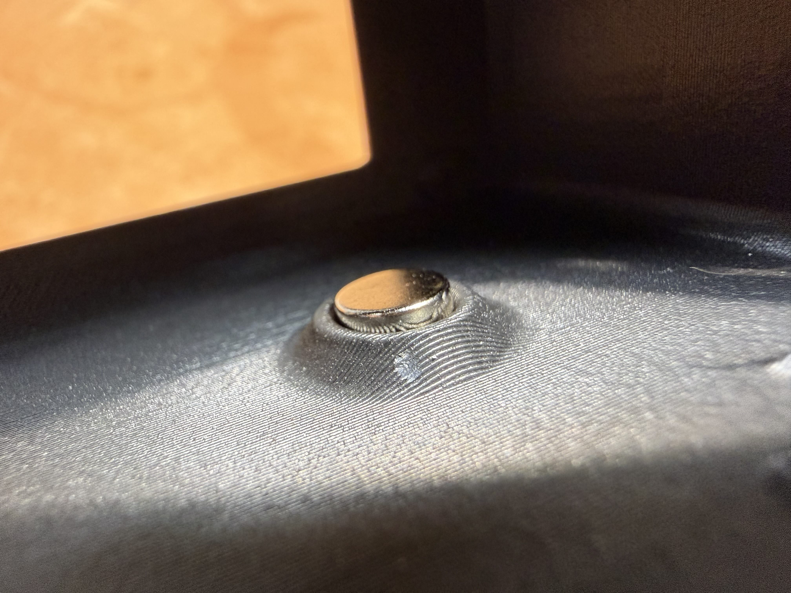
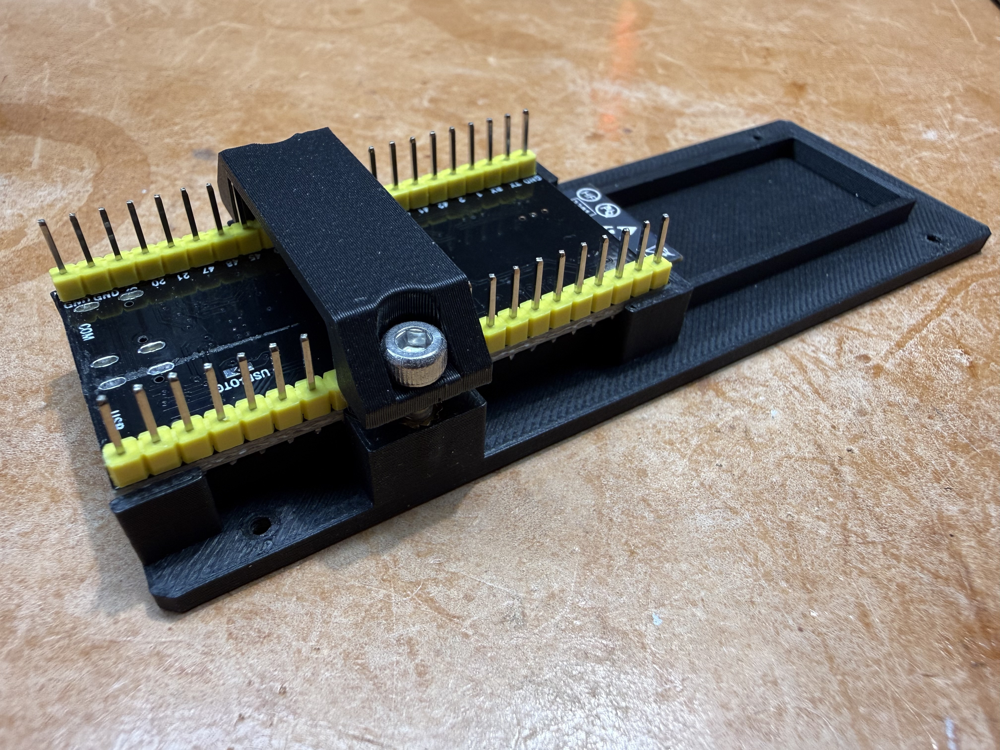
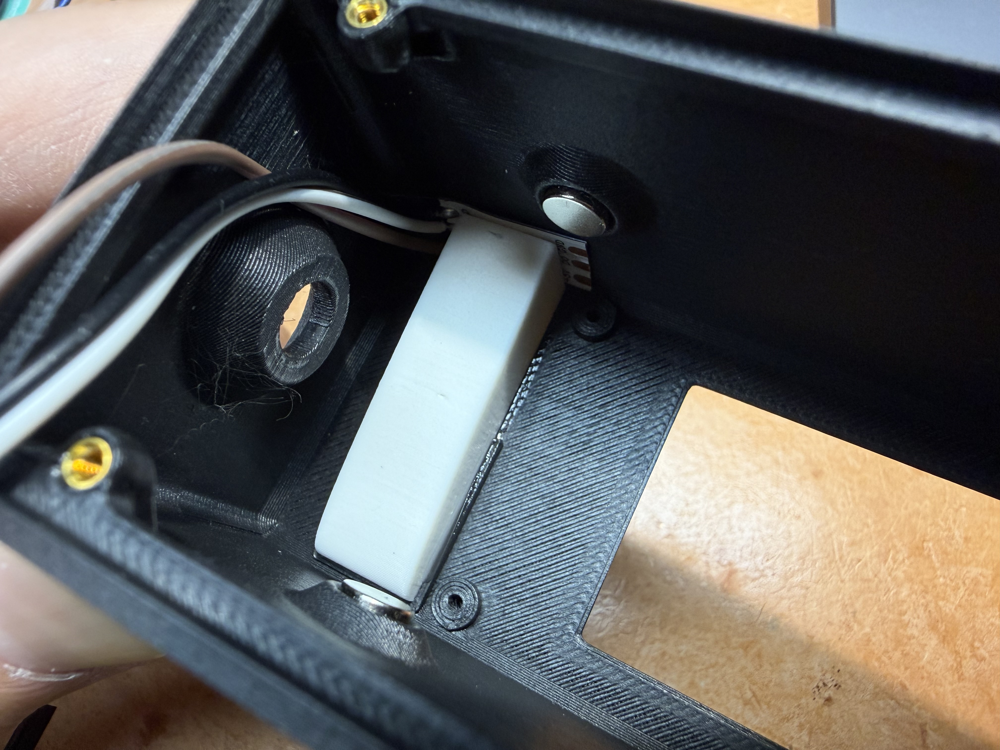
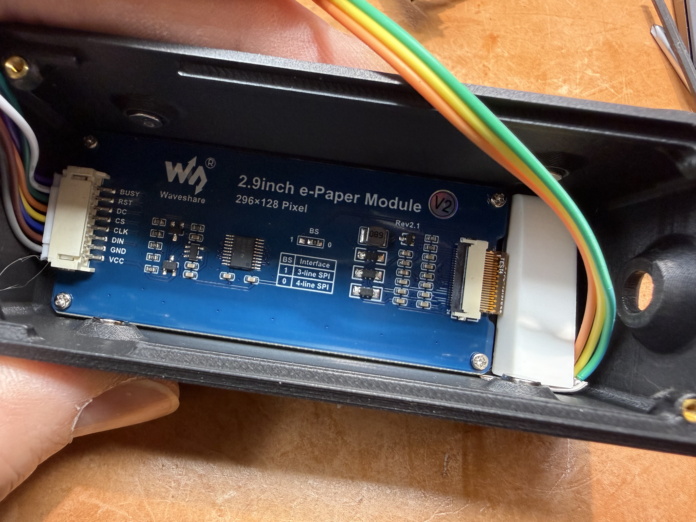
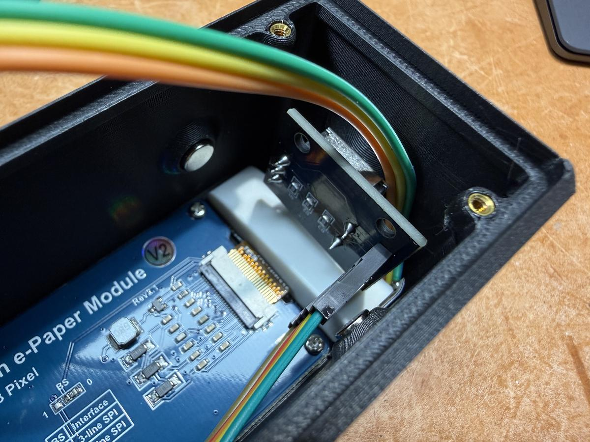
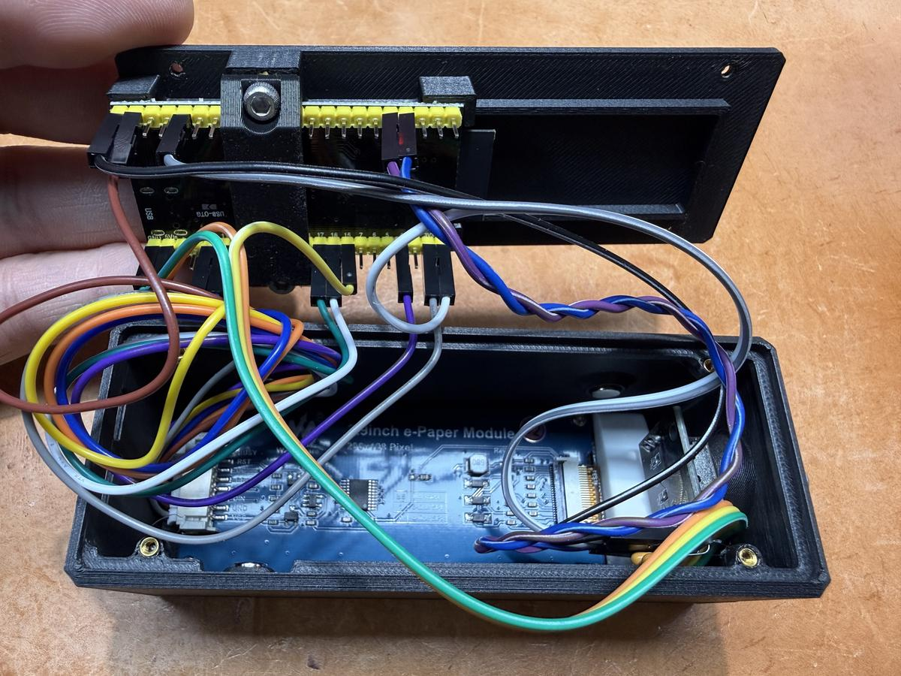

# 🔧 CryptoBar Assembly Guide

Complete step-by-step instructions for assembling your CryptoBar hardware.

> **⚠️ Important:** This guide assumes you have all components listed in the [Hardware Guide BOM](HARDWARE_GUIDE.md#bill-of-materials-bom). Read through all steps before starting assembly.

## 📋 Table of Contents

- [🔧 CryptoBar Assembly Guide](#-cryptobar-assembly-guide)
  - [📋 Table of Contents](#-table-of-contents)
  - [🛠️ Required Tools](#️-required-tools)
  - [📦 Pre-Assembly Checklist](#-pre-assembly-checklist)
  - [⚡ Assembly Steps](#-assembly-steps)
    - [Step 1: Verify ESP32-S3 Module and Solder Pin Headers](#step-1-verify-esp32-s3-module-and-solder-pin-headers)
    - [Step 2: Solder 5V-OUT PAD for LED Power](#step-2-solder-5v-out-pad-for-led-power)
    - [Step 3: Flash Firmware](#step-3-flash-firmware)
    - [Step 4: Verify E-ink Display Model](#step-4-verify-e-ink-display-model)
    - [Step 5: Modify Rotary Encoder](#step-5-modify-rotary-encoder)
    - [Step 6: Cut WS2812B LED from Strip](#step-6-cut-ws2812b-led-from-strip)
    - [Step 7: Solder LED Ribbon Cable](#step-7-solder-led-ribbon-cable)
    - [Step 8: Install LED into Lens](#step-8-install-led-into-lens)
    - [Step 9: Install M2 Heat Set Inserts (Front Case)](#step-9-install-m2-heat-set-inserts-front-case)
    - [Step 10: Install M3 Heat Set Inserts (Back Cover)](#step-10-install-m3-heat-set-inserts-back-cover)
    - [Step 11: Install Magnets (OPTIONAL - For Stacking Only)](#step-11-install-magnets-optional---for-stacking-only)
    - [Step 12: Mount ESP32-S3 to Back Cover](#step-12-mount-esp32-s3-to-back-cover)
    - [Step 13: Install LED Lens to Front Case](#step-13-install-led-lens-to-front-case)
    - [Step 14: Install E-ink Display](#step-14-install-e-ink-display)
    - [Step 15: Install Rotary Encoder](#step-15-install-rotary-encoder)
    - [Step 16: Complete All Wiring](#step-16-complete-all-wiring)
    - [Step 17: Test Before Final Assembly](#step-17-test-before-final-assembly)
    - [Step 18: Install Knob](#step-18-install-knob)
    - [Step 19: Assembly Complete! 🎉](#step-19-assembly-complete-)
  - [🔍 Troubleshooting](#-troubleshooting)
  - [📚 Additional Resources](#-additional-resources)

---

## 🛠️ Required Tools

- **Soldering iron** (temperature controlled, 320-350°C recommended)
- **Solder wire** (lead-free or 63/37 tin-lead)
- **Wire cutters** (flush cutters preferred)
- **Heat set insert installation tool** (or soldering iron tip)
- **Tweezers** (for small component handling)
- **Super glue or hot glue gun** (for LED installation)
- **Multimeter** (optional, for continuity testing)
- **USB-C cable** (for programming and power)
- **Computer with Visual Studio Code** (for firmware flashing)

---

## 📦 Pre-Assembly Checklist

Before starting, verify you have all components:

**Electronics:**
- [ ] ESP32-S3-DevKitC-1 **N16R8** (16MB Flash, 8MB PSRAM)
- [ ] WaveShare 2.9" B&W E-ink display (with **V2 sticker**)
- [ ] KY-040 rotary encoder module
- [ ] WS2812B addressable RGB LED (single LED or strip)
- [ ] Ribbon cable (for LED wiring)＃for led and encoder#
- [ ] Pin headers (if not pre-soldered on ESP32)

**3D Printed Parts:**
- [ ] Matte_Black_Front_Case_V1
- [ ] Matte_Black_Back_Cover_V1
- [ ] Matte_White_LED_Lens_V1
- [ ] Matte_Black_PCB_Strap_V1
- [ ] Matte_Black_Knob_V1

**Hardware:**
- [ ] M2 heat set inserts (4x) - for back cover attachment
- [ ] M2 x 5mm flat head screws (4x) - for final assembly (attaching back cover to front case)
- [ ] M3 heat set inserts (2x) - for ESP32 mounting
- [ ] M3 x 8mm hex screws (2x) - for ESP32 mounting
- [ ] Small magnets 4mm x 6mm (4x) - **OPTIONAL** if stacking multiple units

**Note:** E-ink display uses its own screws (included with the display). The M2 x 5mm screws listed above are for attaching the back cover, NOT for the display.

---

## ⚡ Assembly Steps

### Step 1: Verify ESP32-S3 Module and Solder Pin Headers

**⚠️ CRITICAL:** Ensure you have the **ESP32-S3-DevKitC-1 N16R8** version (16MB Flash + 8MB PSRAM). The N8R8 version is unstable and not supported.

**How to verify:**
- Check the module label on the ESP32-S3 chip
- Look for "N16R8" marking on the silver shield

**Pin header soldering:**
1. If pin headers are not pre-soldered, insert them into the ESP32-S3 board
2. Use a breadboard or helping hands to keep headers perpendicular
3. Solder all pins on both sides (2x19 pins = 38 total)
4. Ensure good solder joints with smooth, shiny finish


*ESP32-S3-DevKitC-1 N16R8 with pin headers soldered*

---

### Step 2: Solder 5V-OUT PAD for LED Power

**⚠️ IMPORTANT:** The WS2812B LED requires 5V power. The ESP32-S3 DevKit has a solder pad labeled **5V-OUT** #or in-out# on the back that must be bridged.

**Location:** Bottom side of the ESP32-S3 DevKit board, near the USB-C connector

**Procedure:**
1. Locate the **5V-OUT** solder pad (two small pads close together)
2. Apply flux to both pads
3. Heat soldering iron to 350°C
4. Bridge the two pads with a small amount of solder
5. Verify continuity between the 5V pin and USB 5V with multimeter

**Why this is needed:** By default, the 5V pin is not connected to USB power. Bridging this pad enables 5V output on the pin header.


*5V-OUT PAD location (circled in red) near the USB-C connector on the back of the ESP32-S3 board*

---

### Step 3: Flash Firmware

Before proceeding with mechanical assembly, flash the firmware to verify the ESP32-S3 is working correctly.

**Requirements:**
- Visual Studio Code with PlatformIO extension
- Git (to clone repository)
- USB-C cable

**Procedure:**

1. **Clone the repository:**
   ```bash
   git clone https://github.com/max05210238/CryptoBar.git
   cd CryptoBar
   ```

2. **Open in Visual Studio Code:**
   ```bash
   code .
   ```

3. **Install PlatformIO extension** if not already installed

4. **Build and upload:**
   - Click PlatformIO icon in left sidebar
   - Select "Upload" under esp32-s3-devkitc-1 environment
   - Wait for compilation and upload to complete

5. **Verify successful flash:**
   - Open Serial Monitor (115200 baud)
   - You should see boot messages and "CryptoBar" initialization logs

> **Note:** Detailed firmware flashing instructions are available in the [Developer Guide](DEVELOPER_GUIDE.md#build--flash-instructions).

---

### Step 4: Verify E-ink Display Model

**⚠️ CRITICAL:** Only the **WaveShare 2.9" B&W V2** display is supported. Using V1 or incompatible displays will not work.

**How to verify:**
- Look for a **V2 sticker** on the display's ribbon cable or back#Look for a **V2 sticker** on the back#
- The V2 model has a different driver IC than V1

**If you have the wrong version:**
- Purchase the correct V2 display from [Amazon link in Hardware Guide](HARDWARE_GUIDE.md#bill-of-materials-bom)

---

### Step 5: Modify Rotary Encoder

The KY-040 rotary encoder module needs modification to fit inside the enclosure.

**Required modifications:**

1. **Remove 90° pin headers:**
#- Remove the pin holder cleanly need good soldering skills, if you are not certain you can do it, you can cut it off#
   - Use flush cutters to clip off the right-angle pin headers
   - Clean up the pads with solder wick if needed
   - You will solder wires directly to these pads later

2. **Remove center mounting pin (OPTIONAL but recommended):**#not optional, it's required#
   - The encoder has a small metal pin at the center for PCB mounting
   - This pin prevents the encoder from sitting flush in the enclosure
   - Use wire cutters to carefully clip this pin as close to the base as possible
   - File smooth if needed

**⚠️ Be careful not to damage the encoder mechanism while modifying.**


*KY-040 rotary encoder with 90° pin headers removed and ribbon cable soldered*


*Center mounting pin (circled in red) should be removed for flush installation*

---

### Step 6: Cut WS2812B LED from Strip

If using a WS2812B LED strip, you need to cut a single LED.

**Procedure:**
1. Identify the cut lines on the LED strip (usually marked with scissors symbol)
2. Use flush cutters to cut exactly on the cut line
3. You should have one LED with 3 solder pads on each side (VCC, DATA, GND)

**If using individual WS2812B LED:**
- Skip this step


*Cut WS2812B LED at the marked cut line (scissors symbol)*

---

### Step 7: Solder LED Ribbon Cable

**⚠️ CRITICAL:** Pay attention to the **arrow direction** on the WS2812B LED. Data flows in only one direction.

**LED Orientation:**
- The LED has a small arrow (△) indicating data direction
- Arrow should point **AWAY** from the data input pad
- Typical pad labels: **5V / DIN / GND** or **VCC / DATA / GND**

**Procedure:**

1. **Prepare ribbon cable:**
   - Cut 3 wires from ribbon cable, approximately 8-10cm length#10-15cm#
   - Strip 2-3mm from each end#one end, keep the female Dupont end, that will be used for plugging into the ESP32#

2. **Solder to LED:**
   - **Power wire** → 5V/VCC pad
   - **Data wire** → DIN/DATA pad (input side, where arrow points FROM)
   - **Ground wire** → GND pad

3. **Heat shrink or insulate:**#this part not needed#
   - Use small heat shrink tubing on each wire
   - Ensure no solder joints are touching

4. **Test with multimeter:**
   - Verify no shorts between adjacent pads


*Pay attention to the arrow marking (circled in red) - solder wires to the INPUT side where the arrow points FROM*

---

### Step 8: Install LED into Lens

The LED must be secured inside the **Matte_White_LED_Lens_V1** part.

**Procedure:**

1. **Test fit first:**
   - Insert LED into the lens cavity (square recess)
   - LED will fit in the square recess, it might not be flush with the surface, that is normal

2. **Apply adhesive:**
   - Use a small drop of super glue (cyanoacrylate) **OR**
   - Use hot glue gun for repositionable bond

3. **Position LED:**
   - Center the LED in the lens cavity
   - Ensure the LED faces **into the lens**
   - **⚠️ The cable direction is CRITICAL** - please make sure it's the same as shown in the photo

4. **Allow to cure:**
   - Super glue: 30-60 seconds
   - Hot glue: 2-3 minutes

**⚠️ Do not use too much glue** - excess glue can seep into the LED or block light.


*WS2812B LED glued into the white LED lens with wires routed the same direction shown here*

---

### Step 9: Install M2 Heat Set Inserts (Front Case)

The **Matte_Black_Front_Case_V1** requires 4x M2 heat set inserts for attaching the back cover.

**Tools needed:**
- Soldering iron with clean tip (or dedicated heat set insert tip)
- Temperature: 200-220°C for PLA, 240-260°C for PETG/ABS

**Procedure:**

1. **Identify insert locations:**
   - There are 4 holes around the opening of the front case
   - Located at the corners where the back cover will mount

2. **Heat the insert:**
   - Hold M2 heat set insert with needle-nose pliers or tweezers
   - Touch with hot soldering iron tip for 2-3 seconds

3. **Insert into plastic:**
   - Align insert with hole (use perpendicular approach)
   - Apply gentle, even pressure
   - Insert should sink until flush with surface
   - **Do not over-insert** - stop when flush

4. **Allow to cool:**
   - Wait 30 seconds before handling
   - Verify insert is secure and flush

5. **Repeat for all 4 inserts**

**⚠️ Common mistakes:**
- Inserting crooked (ruins the hole - may need to re-print)
- Inserting too fast (melts too much plastic)
- Temperature too high (warps the part)


*M2 heat set insert installed flush in the front case - insert must be below the surface*

---

### Step 10: Install M3 Heat Set Inserts (Back Cover)

The **Matte_Black_Back_Cover_V1** requires 2x M3 heat set inserts for the final assembly screws.#for attaching Matte_Black_PCB_Strap_V1#

**Procedure:**

1. **Identify insert locations:**
   - There are 2 holes on the back cover
   - Located on the left and right sides#on each sides where the ESP32 will be installed#

2. **Follow same procedure as Step 9:**
   - Heat M3 insert with soldering iron (200-260°C depending on material)
   - Align carefully and apply gentle pressure
   - Insert until flush with surface

3. **Verify alignment:**
   - Look from the side to ensure insert is perpendicular
   - If crooked, reheat and adjust before it cools


*M3 heat set insert installed in the back cover for final assembly screws*

---

### Step 11: Install Magnets (OPTIONAL - For Stacking Only)

**⚠️ This step is OPTIONAL.** Only perform if you plan to **stack multiple CryptoBar units vertically**.

**Components:**
- 4x small magnets (4mm x 6mm)

**Magnet locations:**
- Front case top (inside): 2 magnet cavities
- Front case bottom (inside): 2 magnet cavities

**Procedure:**

1. **Test polarity first:**
   - Take 4 magnets and let them snap together
   - Pick one magnet on the end and mark the face with permanent marker
   - **Critical:** Make sure that the marked side is always facing up when insert

2. **Install in front case:**
   - Apply small drop of super glue in magnet cavity if the fit is loose#if the fit is loose should move to the front#
   - Insert magnet with correct pole facing up
   - Repeat for all 4 magnets (2 on top, 2 on bottom)
   #-be very careful about the pole, it is not very easy to remove#

3. **Allow to cure:**
   - Wait 5 minutes before handling

**Polarity check:**
- Hold front case near another front case
- They should snap together with magnetic attraction
- If they repel, you installed magnets with wrong polarity (need to re-do)


*Small 4mm x 6mm magnet installed in the front case cavity (tight friction fit or with glue)*

---

### Step 12: Mount ESP32-S3 to Back Cover

**Components needed:**
- ESP32-S3 module (with pin headers soldered from Step 1)
- Matte_Black_Back_Cover_V1 (with M3 inserts installed from Step 10)
- Matte_Black_PCB_Strap_V1 (3D printed part)
- 2x M3 x 8mm hex screws

**Procedure:**

1. **Position ESP32-S3 in back cover:**
   - Place ESP32-S3 with **component side facing DOWN** (pin headers pointing UP)
   - Pin headers should point upward (toward the front)

2. **Install PCB strap:**
   - Place the PCB_Strap over the ESP32-S3 pins
   - Strap should press the ESP32-S3 firmly against the back cover

3. **Secure with screws:**
   - Insert 2x M3 x 8mm hex screws through the strap into the M3 heat set inserts
   - **⚠️ CRITICAL:** Tighten screws VERY GENTLY - just slightly snug
   - **Do NOT fully tighten** - this will warp and damage the ESP32-S3 PCB#it's normal to have a large gap between the strap and back case#
   - After tightening, check from the side to ensure PCB is NOT bent or warped

4. **Verify installation:**
   - ESP32-S3 should be held securely but NOT bent
   - Pin headers should be exposed and accessible#a few pins will be covered, but thouse are not used#
   - PCB should be completely flat (no warping)


*ESP32-S3 secured to back cover with PCB strap and M3 screws (lightly tightened only)*

---

### Step 13: Install LED Lens to Front Case

The **Matte_White_LED_Lens_V1** (with LED installed from Step 8) snaps into the front case.#it doesn't snap in, but will be a tight fit#

**Procedure:**

1. **Align lens:**
   - The lens has alignment features that match the front case
   - Position the lens over the light window opening

2. **Press to snap:**
   - Apply firm, even pressure
   - You should hear/feel a click when fully seated
   - Lens should be flush with front case surface

3. **Secure with glue:**
   - Apply some CA glue between the seams of the lens and front case to hold it together

4. **Verify installation:**
   - Lens should not wobble or come loose
   - LED should be visible through the lens
   - Wires should have enough slack (8-10cm)


*White LED lens with WS2812B LED snapped into the front case*

---

### Step 14: Install E-ink Display

**Components:**
- WaveShare 2.9" B&W V2 e-ink display
#- WaveShare cable for screen(it should comes with the display)#

**Procedure:**

1. **Remove screws from display:**
   - Remove the 4 small screws from the display PCB
   - **Keep these screws** - you will use them to mount the display
   - Remove the small standoffs (copper pillars)
   - **Discard the standoffs** - they are not needed

2. **Remove protective film:**
   - Peel off the protective film from the display
  
#add a step to install the screen cable, the connector is just a plug in type, no lock, the other side have female Dupont connectors for connecting to the ESP32#

3. **Position display in front case:**
   - Place display into the **Matte_Black_Front_Case_V1**
   - **Orientation:** The end WITHOUT the ribbon cable should face toward the LED#led lens#
   - Ribbon cable should exit toward the bottom#remove this line#

4. **Screw down display:**
   - Use the 4 small screws you removed in step 1#step 14-1#
   - **⚠️ CRITICAL:** You are screwing directly into the 3D printed plastic (NOT into heat set inserts)
   - Start all 4 screws by hand first (do not tighten)#remove first#
   - Once all 4 are started, tighten VERY GENTLY in a cross pattern:
     - Top-left → Bottom-right → Top-right → Bottom-left
   - **⚠️ Do not over-tighten** - just slightly snug is enough
   - Over-tightening will strip the plastic threads

5. **Verify display:**
   - Display should sit flat against the front case
   - No gaps or warping
   - Ribbon cable should have enough slack to reach the ESP32


*WaveShare 2.9" e-ink display mounted in the front case with its original screws screwed directly into plastic*

---

### Step 15: Install Rotary Encoder

**Components:**
- Modified KY-040 rotary encoder (from Step 5)

**Procedure:**

1. **Insert encoder through front case:**
   - The encoder shaft goes through the round hole in the front case
   - Encoder body sits inside the case
    #-make sure the PCB is rotated to the right location, see photo#

2. **Secure with nut:**
   - The encoder comes with a metal washer and hex nut
   - Place washer on the shaft (outside the case)
   - Thread the hex nut onto the shaft
   - Can use pliers, but please be gentle

**⚠️ Do not over-tighten the nut** - it can crack the plastic case or damage the encoder threads.


*KY-040 rotary encoder mounted through the front case with washer and nut*

---

### Step 16: Complete All Wiring

**⚠️ CRITICAL STEP:** Incorrect wiring can damage components. Double-check all connections before powering on.

**Complete Pin Assignment Table:**

| Component | Component Pin | ESP32-S3 Pin | Notes |
|-----------|---------------|--------------|-------|
| **E-ink Display** | VCC | 3V3 | 3.3V power |
| | GND | GND | Ground |
| | DIN (MOSI) | GPIO 11 | SPI data |
| | CLK (SCK) | GPIO 12 | SPI clock |
| | CS | GPIO 10 | Chip select |
| | DC | GPIO 17 | Data/Command |
| | RST | GPIO 16 | Reset |
| | BUSY | GPIO 4 | Busy signal |
| **WS2812B LED** | VCC | 5V | 5V power (from 5V-OUT pad) |
| | DIN | GPIO 15 | Data input |
| | GND | GND | Ground |
| **Rotary Encoder (KY-040)** | + | 3V3 | 3.3V power |
| | GND | GND | Ground |
| | SW | GPIO 21 | Push button |
| | DT | GPIO 1 | Encoder B (PCNT) |
| | CLK | GPIO 2 | Encoder A (PCNT) |

**Wiring Procedure:**

All wires have Dupont connectors and can be plugged directly into ESP32-S3 pin headers.

1. **Connect encoder wires to ESP32-S3:**
   - Plug encoder wires into the correct ESP32-S3 pins according to the table above
   - **Double-check the pin assignment before connecting**
   - Encoder + → ESP32 3V3
   - Encoder GND → ESP32 GND
   - Encoder SW → ESP32 GPIO 21
   - Encoder DT → ESP32 GPIO 1
   - Encoder CLK → ESP32 GPIO 2

2. **Connect display cable:**
   - The display module includes a cable with ribbon connector on one end and Dupont connectors on the other
   - **Connect to display module:**#remove this connecting ribbon cable part, already did that in the previus step#
     - Lift the black retaining clip on the display's PCB connector
     - Insert ribbon cable (contacts facing down)
     - Press retaining clip down to lock
   - **Connect to ESP32-S3:**
     - Plug each Dupont connector into the correct ESP32-S3 pin according to the table above
     - Display VCC → ESP32 3V3
     - Display GND → ESP32 GND
     - Display DIN (MOSI) → ESP32 GPIO 11
     - Display CLK (SCK) → ESP32 GPIO 12
     - Display CS → ESP32 GPIO 10
     - Display DC → ESP32 GPIO 17
     - Display RST → ESP32 GPIO 16
     - Display BUSY → ESP32 GPIO 4

3. **Connect LED wires to ESP32-S3:**
   - Plug LED wires into the correct ESP32-S3 pins
   - LED VCC → ESP32 5V pin
   - LED DIN → ESP32 GPIO 15
   - LED GND → ESP32 GND

4. **Verify all connections:**
   - Double-check each connection against the pin assignment table
   - Ensure all Dupont connectors are firmly seated on the pins
   - Verify no adjacent pins are accidentally bridged

**⚠️ Common wiring mistakes:**
- Swapping CLK and DT on encoder (encoder will count backward)
- Connecting LED to 3.3V instead of 5V (LED won't light)
- Forgetting to bridge 5V-OUT pad (LED has no power)
- Reversing display ribbon cable (display won't work)#remove this line, the display cable is not reversible#

---

### Step 17: Test Before Final Assembly

**⚠️ CRITICAL:** Test the device before closing the enclosure. Debugging is much harder after assembly.

**Procedure:**

1. **Visual inspection:**
   - Check all Dupont connectors are firmly seated
   - Verify no loose connections
   - Ensure no adjacent pins are accidentally bridged

2. **Power on test:**
   - Connect USB-C cable to ESP32-S3
   - Device should boot (check Serial Monitor at 115200 baud)
   - You should see boot logs and "CryptoBar" initialization

3. **Display test:**
   - Display should show the CryptoBar splash screen
   - If display shows nothing: check wiring and ribbon cable
   - If display shows garbage: likely wrong display version (need V2)

4. **LED test:**
   - LED should light up during boot (rainbow animation or solid color)#it will light up blue#
   - If LED doesn't light:
     - Check 5V-OUT pad is bridged
     - Check GPIO 15 connection
     - Verify LED polarity (arrow direction)
#- make sure the soldering is not broken, these wires are thine, will break if rotated too many times#

5. **Encoder test:**
   - Rotate encoder clockwise/counter-clockwise
   - Display should respond (menu navigation)
   - Press encoder button
   - Display should respond (enter/select action)

6. **Full function test:**
   - Configure WiFi (if not already done)
   - Verify price display updates
   - Test menu navigation
   - Test all display modes


**If any test fails, DO NOT proceed to final assembly.** Refer to [Troubleshooting](#troubleshooting) section.


*All components wired and tested before final enclosure assembly - verify LED lights up, display works, and encoder responds*

---

### Step 18: Install Knob

**Components:**
- Matte_Black_Knob_V1 (3D printed part)

**Procedure:**

1. **Align knob with encoder shaft:**
   - The knob has a D-shaped hole that matches the encoder shaft#does not have a D-shaped, just a rounds whole#
   - Some encoders have round shafts (use set screw to secure)#our knob does not have set screws#

2. **Press knob onto shaft:**
   - Apply firm, even pressure
   - Knob should slide down until it bottoms out on the encoder nut
   - **Do not force** - if too tight, sand the inside of the knob slightly

3. **Secure knob (if applicable):**
   - If knob has a set screw, tighten with Allen key#remove this line#
   - Position set screw over the flat side of the shaft (if D-shaft)#remove this line#
    # the knob shold be a tight fit, if too loose, apply a very tiny dot of CA glue#

4. **Test rotation:**
   - Rotate knob smoothly
   - Should have tactile clicks (from encoder detents)
   - Knob should not wobble or come loose

---

### Step 19: Assembly Complete! 🎉

**Final assembly:**

1. **Align front case and back cover:**
   - All wires should be neatly routed inside
   - No wires should be pinched

2. **Close enclosure:**
   - Gently press front and back together
   - You should feel/hear snaps as the case closes#not snaps, but make sure the back cover sit flush in the front case#

3. **Install M3 screws:**
   - Use 2x M3 x 8mm hex screws#4 M2 x 5mm flat head screws#
   - Screw into the M3 heat set inserts (from Step 10)#M2#
   - Tighten with hex driver (do not over-tighten)

4. **Final inspection:**
   - All parts should be flush
   - No gaps in the enclosure
   - USB-C port accessible
   - Knob rotates smoothly

**Your CryptoBar is now complete!**


*Completed CryptoBar showing splash screen - ready to configure and use!*

Next steps:
- [Configure WiFi and API keys](../README.md#initial-setup)
- [Customize display settings](DISPLAY_GUIDE.md)
- [Set up OTA updates](OTA_UPDATE_GUIDE.md)

---

## 🔍 Troubleshooting

### Display Issues

**Display shows nothing:**
- Check ribbon cable is fully inserted and locked
- Verify BUSY pin connection (GPIO 15)
- Check 3.3V power to display

**Display shows garbage/random pixels:**
- Wrong display version (need WaveShare V2, not V1)
- Incorrect wiring (verify all 8 pins)
- Bad solder joint on CS/DC/RST pins

**Display is very slow:**
- Normal behavior for e-ink displays
- Full refresh takes 2-3 seconds
- Partial refresh takes 0.5-1 second

### LED Issues

**LED doesn't light up:**
- Check 5V-OUT pad is bridged on ESP32
- Verify GPIO 48 connection#gpio 15#
- Check LED polarity (arrow direction matters)
- Test with multimeter: 5V pin should measure 5V when USB connected

**LED wrong color:**
- Normal - LED color is software controlled
- Default boot color may vary by firmware version

**LED flickers:**
- Loose connection on data or ground wire
- Check solder joints

### Encoder Issues

**Encoder doesn't respond:**
- Check all 5 wires (VCC, GND, SW, DT, CLK)
- Verify GPIO 1, 2, 42 connections#gpio 1, 2, 21#
- Test button press (GPIO 42 should go LOW when pressed)#GPIO 21#

**Encoder counts backward:**
- CLK and DT wires are swapped
- Swap GPIO 1 and GPIO 2 connections

**Encoder skips counts:**
- Loose connection on CLK or DT
- Bad solder joint
- Damaged encoder (replace)

### Boot Issues

**ESP32 doesn't boot:**
- Check USB cable (must be data cable, not charge-only)
- Verify 3.3V power LED on ESP32 is lit
- Check Serial Monitor for error messages

**Firmware upload fails:**
- Wrong USB driver (install CP210x or CH340 driver)
- Wrong board selected in PlatformIO
- Boot mode issue: Hold BOOT button during upload

### Assembly Issues

**Heat set inserts crooked:**
- Reheat with soldering iron and straighten
- If too damaged, fill hole with epoxy and re-drill
- Last resort: re-print the part

**Screws won't thread:**
- Insert may have melted plastic inside threads
- Use screw to "chase" the threads (screw in/out several times)
- If stripped: use larger screw or add threadlocker

**Parts don't fit:**
- 3D printer tolerances vary
- Sand/file parts slightly for better fit
- Check print quality (no warping or elephant's foot)

---

## 📚 Additional Resources

- **[Hardware Guide](HARDWARE_GUIDE.md)** - BOM and component specifications
- **[Display Guide](DISPLAY_GUIDE.md)** - Understanding the UI and settings
- **[OTA Update Guide](OTA_UPDATE_GUIDE.md)** - Wireless firmware updates
- **[Developer Guide](DEVELOPER_GUIDE.md)** - Code architecture and development
- **[Main README](../README.md)** - Project overview and quick start

**Need help?** Open an issue on [GitHub](https://github.com/max05210238/CryptoBar/issues)

---

*Last updated: 2025-12-27*
